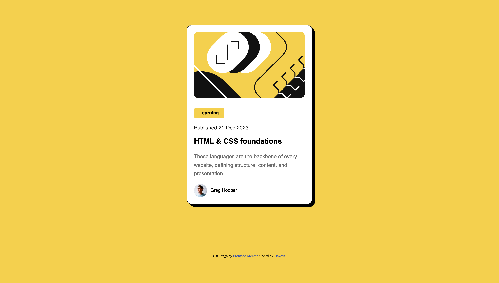

# Frontend Mentor - Blog preview card solution

This is a solution to the [Blog preview card challenge on Frontend Mentor](https://www.frontendmentor.io/challenges/blog-preview-card-ckPaj01IcS). Frontend Mentor challenges help you improve your coding skills by building realistic projects. 

## Table of contents

- [Overview](#overview)
  - [The challenge](#the-challenge)
  - [Screenshot](#screenshot)
  - [Links](#links)
- [My process](#my-process)
  - [Built with](#built-with)
  - [What I learned](#what-i-learned)
  - [Continued development](#continued-development)
  - [Useful resources](#useful-resources)
- [Author](#author)

## Overview

Create a blog preview card page using HTML and CSS. Add interactive elements to the page to make it more appealing.

### The challenge

Users should be able to:

- See hover and focus states for all interactive elements on the page

### Screenshot



### Links

- Solution URL: (https://github.com/dma1h07ra/Blog-Preview-Card)
- Live Site URL: (https://dma1h07ra.github.io/Blog-Preview-Card/)

## My process
- Used the HTML5 markup language to create the basic structure of the webpage.
- Used CSS to further design and add color to the webpage to make it more appealing including the usage of span element and hover feature to change the color of text when hovering over it.

### Built with

- Semantic HTML5 markup
- CSS custom properties
- Flexbox
- CSS Grid

### What I learned

Learned to use hover CSS feature to change the color of the text when the cursor hover over the text.

```css
.heading:hover {
    color: var(--Yellow);
}
```

Also, used the grid method for centering the div.

```css
body {
    background: var(--Yellow);
    display: grid;
    place-items: center;
}
```

### Continued development

CSS is always a work in progress.

### Useful resources

- [MDN web docs](https://developer.mozilla.org/en-US/) - One stop shop for all the commands and functions for HTML and CSS.


## Author

- Frontend Mentor - [@dma1h07ra](https://www.frontendmentor.io/profile/dma1h07ra)